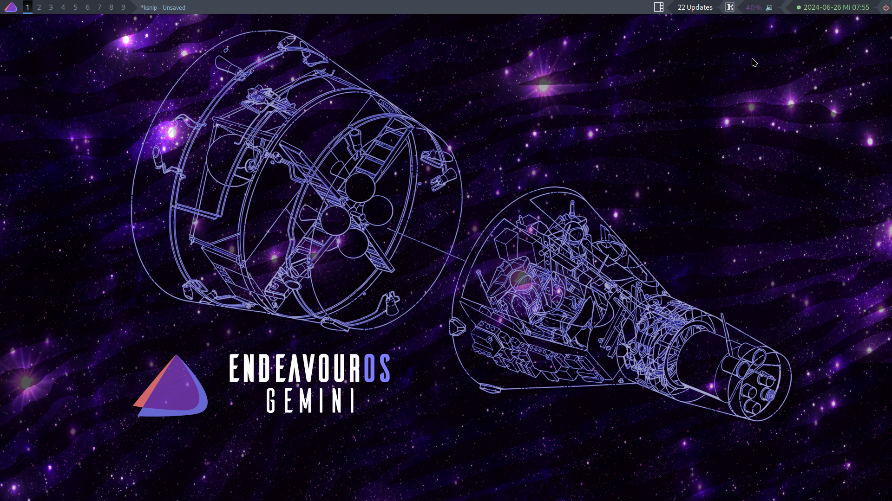
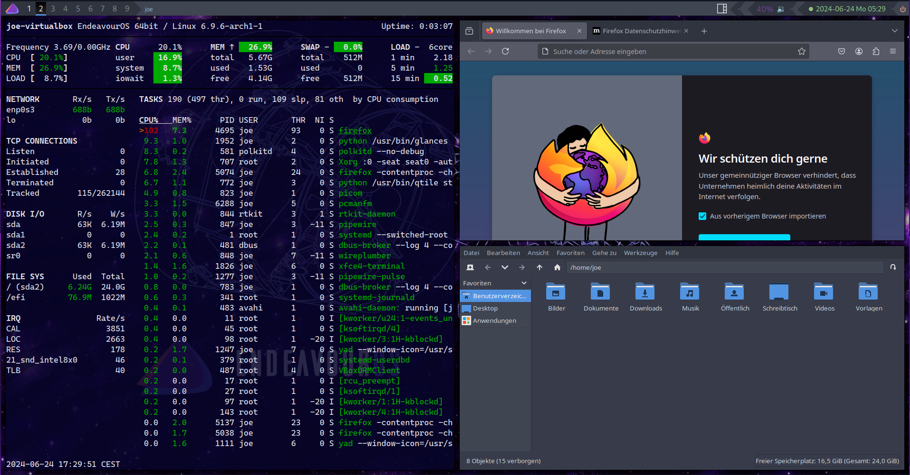

# QTile Setup and Theme for EndeavourOS

**QTile EndeavourOS Community Edition**

---

## Installation:

> **Important:** Don't forget to backup your current configuration files

1. Clone the repo:

```bash
git clone https://github.com/EndeavourOS-Community-Editions/qtile

cd qtile
```

2. Copy the configuration files:

```bash
cp -R .config ~
cp .Xresources ~
cp .gtkrc-2.0 ~
```

3. Install the required packages:

```bash
sudo pacman -Syu --needed - < packages-repository.txt
```

4. Enable Login Manager (SDDM):

```bash
sudo systemctl enable sddm.service
sudo systemctl start sddm.service
```

> **Note:** Currently there is no installation file </br>
> #contributions-welcome

## Screenshots:




## Keybindings:

### Switch Between Windows

-   Move focus to left: <kbd>MOD</kbd>+<kbd>h</kbd>
-   Move focus to right: <kbd>MOD</kbd>+<kbd>l</kbd>
-   Move focus to down: <kbd>MOD</kbd>+<kbd>j</kbd>
-   Move focus to up: <kbd>MOD</kbd>+<kbd>k</kbd>
-   Move window focus to other window: <kbd>MOD</kbd>+<kbd>SPACE</kbd>

### Moving Windows

-   Move window to left: <kbd>MOD</kbd>+<kbd>SHIFT</kbd>+<kbd>h</kbd>
-   Move window to right: <kbd>MOD</kbd>+<kbd>SHIFT</kbd>+<kbd>l</kbd>
-   Move window to down: <kbd>MOD</kbd>+<kbd>SHIFT</kbd>+<kbd>j</kbd>
-   Move window to up: <kbd>MOD</kbd>+<kbd>SHIFT</kbd>+<kbd>k</kbd>

### Resizing Windows

-   Grow: <kbd>MOD</kbd>+<kbd>CTRL</kbd>+<kbd>h</kbd>
-   Shrink: <kbd>MOD</kbd>+<kbd>CTRL</kbd>+<kbd>l</kbd>
-   Reset: <kbd>MOD</kbd>+<kbd>n</kbd>

### Layouts

-   Next layout: <kbd>MOD</kbd>+<kbd>TAB</kbd>
-   Flip Layout: <kbd>MOD</kbd>+<kbd>CTRL</kbd>+<kbd>SPACE</kbd>

### Utility

-   Kill focused Window: <kbd>MOD</kbd>+<kbd>w</kbd>

-   Restart QTile: <kbd>MOD</kbd>+<kbd>CTRL</kbd>+<kbd>r</kbd>
-   Shutdown QTile: <kbd>MOD</kbd>+<kbd>CTRL</kbd>+<kbd>q</kbd>
-   Launch terminal: <kbd>MOD</kbd>+<kbd>RETURN</kbd>
-   Spawn Rofi: <kbd>MOD</kbd>+<kbd>r</kbd>

### Volume

-   Raise Volume: <kbd>XF86AudioRaiseVolume</kbd>
-   Lower Volume: <kbd>XF86AudioLowerVolume</kbd>
-   Mute: <kbd>XF86AudioMute</kbd>

### Groups

-   Next Group: <kbd>MOD</kbd>+<kbd>RIGHT</kbd>
-   Previous Group: <kbd>MOD</kbd>+<kbd>LEFT</kbd>
-   Switch to Group {i}: <kbd>MOD</kbd>+<kbd>i</kbd>
-   Switch to & move focused window to Group {i}: <kbd>MOD</kbd>+<kbd>SHIFT</kbd>+<kbd>i</kbd>

### Mouse

-   Move floating windows: <kbd>MOD</kbd>+<kbd>Mouse:Button1</kbd>
-   Change floating window size: <kbd>MOD</kbd>+<kbd>Mouse:Button3</kbd>
-   Bring to floating window to front: <kbd>MOD</kbd>+<kbd>Mouse:Button2</kbd>

---

# Contributions are Welcome!

## Project needs maintainers
